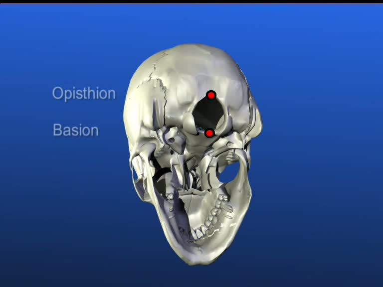
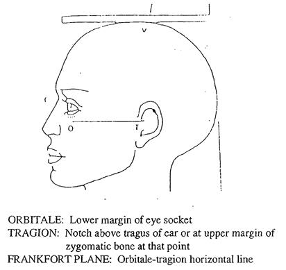
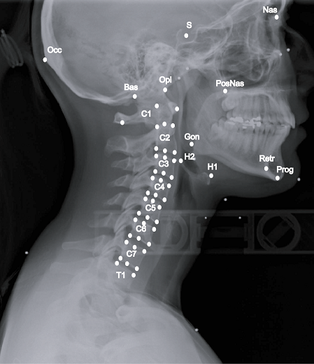
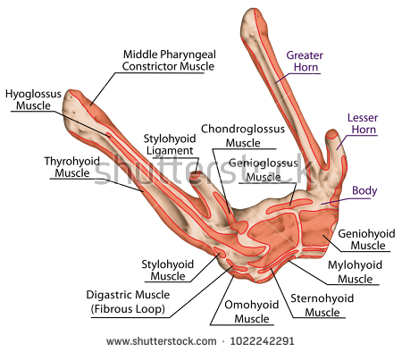
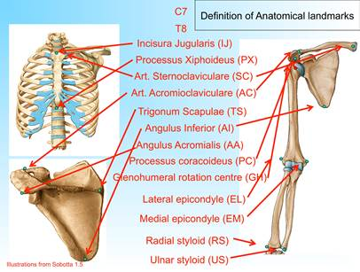
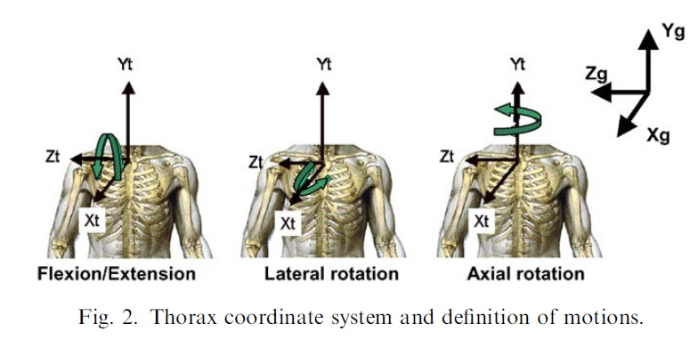

## The bone files are from AV and her group 
### Work done at WSU (bone models segmented in 3D doctor)
- File types: .obj or .asc 
- Cooridinate System (CS)
   - They are in CT gobal CS originally, unit=mm;
   -  CJ appiled a matlab code (using PCA) to make several bones (C1 to T2) into their local CS (under foler "\Corrected for local CS_byCJ"), unit=m.

### Work done by LZ
**1. Scale the bone files into meter (use .obj files)**
  - Use a free software [MeshLab](http://www.meshlab.net/), check out the [tutorial](http://www.cse.iitd.ac.in/~mcs112609/Meshlab%20Tutorial.pdf).
    - Scale: in MeshLab, the transformations can be found under FILTERS / NORMALS, CURVATURES AND ORIENTATION / TRANSFORM… 
    - Save as new .obj files (unit: meter)

**2. Transform the bony structions below T1 into the T1 CS (i.e., fixed with T1)**
- Obtain the transformation for T1 (from the CT global CS to T1 local CS; both models are provided by CJ): 
  - Use MeshLab (Mac 64bit v1.3.3) "Align" feature ([YouTube tutorial](https://www.youtube.com/watch?v=4g9Hap4rX0k))
    - Load two T1 models
    - Go to "Edit"--> "Align"-->  pick T1_localCS model as ""glue mesh here" to serve as a base --> pick T1_CTCS model and click "Point Based Glueing" --> double click to select corresponding points on both models --> "process" --> "File"/"Save Projec"/save as "Align Project (*.aln)": [T1_alignment.aln](T1_alignment.aln)
    - From T1_meter.obj (CT CS) to T1.obj (local CS): 
    - Transformation matrix= (-0.003448 -0.895853 0.444338 0.080804;-0.020896 -0.444179 -0.895694 -0.175250;0.999776 -0.012374 -0.017188 -0.001771; 0.000000 0.000000 0.000000 1.000000).
- Angles (deg; X,Y,Z)=91.0993   26.3810   90.2205; Translations (m;X,Y,Z)=0.0808   -0.1752   -0.00    - Test the transformation using [testTransformation_sameBone.m](testTransformation_sameBone.m)
    
- Apply the same transformation (from CT global CS to T1 local CS) to other bony structures below T1 to mantiain the original posture in CT images (we don't know their real  neutral postures)
  - T2 to T12: use [Obj_TransformAndSave.m](Obj_TransformAndSave.m), which calls functions [readObj_vf.m](functions/readObj_vf.m), [applyTransformation.m](functions/applyTransformation.m), and [writeObj_vf.m](functions/writeObj_vf.m) --> output a new obj file in T1 local CS (T2_to_T12_meter_T1CS.obj)
  - Similarly, transform L1_to_L5, Clavicles, Scapulas,Rib and Pelvis (such as Ribs_meter.obj, Right_Clavicle_meter.obj and etc.) into the T1 local CS (use [Obj_TransformAndSave_multipleFiles.m](Obj_TransformAndSave_multipleFiles.m), which calls the same three functions as above).
  - Note: The matlab codes above only read and write Vertex and Face data from/to the obj files. The transformed obj files could not be read in OpenSim, so all the MatLab-written obj files have been opened in MeshLab and resaved to new obj files with 'Normal' information ("file"-->"Export mesh as..." and make sure 'Normal' was checked; e.g., "Right_Scapula_meter_T1CS_vnf.obj"-- the obj file in T1 CS with vertex, face and normal information).
  

**3. Transform skull (along with mandible/jaw) into the skull local CS**
- Obtain the bony landmarks of skull in the original CT CS: Opisthion, Basion; Orbitale and Tragion (Frankfort plane)
   
- Define the skull local CS (as following); use the matlab code [SetupLocalCS_Skull.m](SetupLocalCS_Skull.m) to transform the skull and mandible obj files into the defined skull local CS.   
  - Origin: at center of foramen magnum (midpoint from basion to opithion); 
  - X-axis:  parallel to the Frankfort plane (line passing through orbit and tragus), pointing anteriorly
  - In the CT CS:  the sagittal plane looks fine  defined by Y Z  plane

**4. Transform the hyoid bone into the its local CS**
  -  Define the hyoid local CS (as following); use the matlab code [SetupLocalCS_Hyoid.m](SetupLocalCS_Hyoid.m) to transform the hyoid into its defined local CS.
  	  - Origin: the most anterior-superior point (H1)
	  - X axis: passing through H1 and H2, pointing anteriorly
	  - Y axis: perpendicular to X axis, pointing cephalad
	  
 

**5. Adjust shoulder posture (clavicle and scapular bones) to be a "neutral" posture**

The local coordinate systems of Thorax, clavicle and spacula:
--- refers to [Wu-2005_ISB recommendation](Wu-2005_ISB-shoulder joint.pdf); 
--- based on the file "VHM_forShoulderNeutralPosture_0.osim"

  -  Obtain bony landmarks in T1 CS (in OpenSim): 
  
     

  |Landmarks(in T1 CS)      |	 X (m)    |  Y (m)    |	 Z (m)    |
  | -------------           |:-----------:| ---------:| ---------:|
  |Sternoclaviculare_L(SC_L)|	0.0688528 |-0.0197483 |	-0.021618 |
  |Sternoclaviculare_R(SC_R)|	0.0721    |-0.013471  |	0.0297133 |
  |Acromioclaviulare_L(AC_L)|	0.00392632| 0.0105555 |	-0.167512 |
  |Acromioclaviulare_R(AC_R)|	-0.0121487| 0.0228319 |	0.175819  |
  |TrigonumScapulae_L (TS_L)|	-0.0680862|-0.0648523 |	-0.0963781|
  |TrigonumScapulae_R (TS_R)|	-0.0752219|-0.0606393 |	 0.0866429|
  |AngulusInferior_L  (AI_L)|	-0.0323772|-0.181023  |	-0.112415 |
  |AngulusInferior_R  (AI_R)|	-0.0328636|-0.170965  | 0.114151  |
  |AngulusAcromialis_L(AA_L)|	-0.0247613|-0.00506821|	 -0.19215 |
  |AngulusAcromialis_R(AA_R)|	-0.0394764| -0.0103739|	 0.18265  |
  |C7_Spinosus        (C7)  |	-0.0529946| -0.011114 |-0.00383815|
  |T8_Spinosus        (T8)  |-0.00182668  | -0.226247 |0.00186527 |
  |Incisura Jugularis (IJ)  |0.0778201    | -0.0194623|0.00461227 |
  |Processus Xiphoideus(PX) |0.217731     | -0.168973 |0.00933912 |
  
  Notes: referring to the old notes"...\Research_WSU\VHM Model\VHM_updated\SetupLocalCS.xlsx"; the landmarks TS  were adjusted.
  
  - Thorax CS:
    - The origin: coincident with IJ.
	- Y: The line connecting the midpoint between PX and T8 and the midpoint between IJ and C7, pointing upward.
	- Z: The line perpendicular to the plane formed by IJ, C7, and the midpoint between PX and T8,pointing to the right.
	- X: The common line perpendicular to the Z- and Y-axis, pointing forwards.
	
	
  
  
  -  Adjust Clavicle (joint links: T1--> aux_clavicelL or aux_clavicelR (Translation only; XY: sagittal plane, Y: vertical up) --> Rotation only; clavicelL or clavicelR)
     - Create an auxiliary object for clavicle (e.g., "aux_clavicelL" here) in OpenSim (in order to rotate the clavicle to horizontal): [VHM_forShoulderNeutralPosture_clavicle0.jnt](VHM_forShoulderNeutralPosture_clavicle0.jnt)
       - the origin of "aux_clavicelL": Sternoclaviculare_L;
       - Obtain the rotation angle about Z axis to make its Y axis vertical: 31.6324088956378 deg (In M020, the T1 CS tilting angle=-31.6324088956378 deg/ -0.552089685566 radian)
       - notes in joint file: 
       
       beginjoint aux_clavicelL;  segments **T1** aux_clavicelL;  order t r3 r1 r2; axis1 1.000000 0.000000 0.000000; axis2 0.000000 1.000000 0.000000; axis3 0.000000 0.000000 1.000000; tx  constant 0.0688528; ty  constant -0.0197483; tz  constant -0.021618; r1  constant 0.000000; r2  constant 0.000000; r3  constant 31.6324088956378; endjoint.

     - Transform the origin of the clavicle bone to Sternoclaviculare_L: use [SetupLocalCS_Clavicle.m](SetupLocalCS_Clavicle.m) and MeshLab(to get obj files with norm info).
     - Put the new clavicle bone file into aux_clavicelL CS (in OpenSim): [VHM_forShoulderNeutralPosture_clavicle1.jnt](VHM_forShoulderNeutralPosture_clavicle1.jnt)
       - put the clavicle (with new local CS) back to the original CT posture--in joint file: segments aux_clavicelL clavicleL; ...;r1  constant 0.000000; r2  constant 0.000000; r3  constant -31.6324088956378); 
         - notes: obtain the landmarks of clavicle (Sternoclaviculare and Acromioclaviulare; originally in T1 CS) in the new clavicle CS (in OpenSim): in clavicleL CS, Sternoclaviculare_L=0 0 0, Acromioclaviulare_L=-0.0649265 0.0303038 -0.145894;in clavicleR CS, Sternoclaviculare_R=0 0 0, Acromioclaviulare_R=-0.0842487 0.0363029 0.146106.	 
       - set clavicle  close to horizontal (the angle wrt X axis was calculated based on SC-AC angle in aux_clavicelL CS; left clavicle: -22.306 deg/-0.38931 rad; right clavilce: 27.20216 deg/0.474767)--in joint file: segments **aux_clavicelL** clavicleL; ...; r1  constant -22.306; r2  constant 0.000000; r3  constant -31.6324088956378);
     
     
  -  Adjust Scapula (joint linkage: clavicleL/clavicleR-->aux_scapulaL/aux_scapulaR (translation and rotation) --> scapulaL/scapulaR)
     - Translation: move the origin to Acromioclaviulare_L or Acromioclaviulare_R
     - Rotation
	   - Record three landmarks (AC, TS, AI) in clavicleL or clavicelR CS to form the scapular plane
     
     - notes: Check the obj file in MeshLab. When necessary, flip the normals: MeshLab-->"Filters"--> "Normals,Curvatures and Orientation"--> "Invert Faces Orientation" (only check "Force Flip')
  
 
